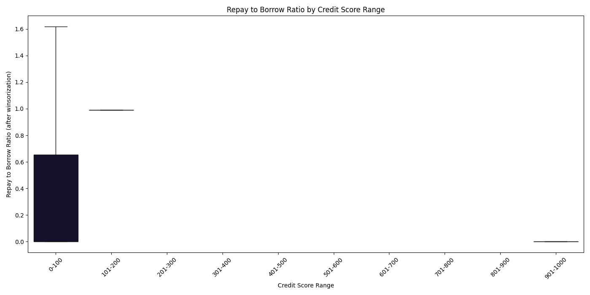

# Detailed Analysis of Aave Wallet Credit Scores

## Introduction
This document provides an in-depth analysis of the methodology, results, and insights derived from assigning credit scores to Aave protocol wallets based on their historical transaction data.

## Data Overview
The analysis is based on 100,000 raw, transaction-level records from the Aave V2 protocol, encompassing actions such as deposits, borrows, repays, and liquidations. Each record contains details like `userWallet`, `action`, `asset`, `amount`, and `value_usd`. The dataset captures a snapshot of on-chain behavior crucial for understanding wallet activity.

## Feature Engineering Details

From the raw transaction data, several features were engineered to capture different aspects of a wallet's interaction with the Aave protocol.

* **Activity Counts:** `total_transactions`, `num_deposits`, `num_borrows`, `num_repays`, `num_redeemunderlying`, `num_liquidations`. These count specific actions, providing a basic volume metric.
* **Value Aggregates:** `total_deposit_usd`, `total_borrow_usd`, `total_repay_usd`, `total_redeem_usd`, `total_liquidation_usd`. These sum the USD values of transactions, reflecting financial engagement. A specific challenge was handling the `value_usd` field for `liquidationcall`, which often indicates the amount of debt covered, not the asset seized. This was handled by checking if `value_usd` was missing and inferring it from `amount` and `asset` (if needed) or by ensuring the feature was handled appropriately in the scoring.
* **Ratios:**
    * `repay_to_borrow_ratio`: Calculated as `total_repay_usd / total_borrow_usd`. This is a critical metric indicating repayment discipline. Values were capped at 1 to prevent extremely high ratios from distorting the score due to small initial borrows being fully repaid.
    * `deposit_utilization_ratio`: `total_borrow_usd / total_deposit_usd`. A proxy for how much of deposited funds are being utilized for borrowing.
    * `liquidation_value_to_borrow_value_ratio`: `total_liquidation_usd / total_borrow_usd`. Indicates the proportion of borrowed funds that resulted in liquidation.
    * `liquidation_calls_per_transaction_ratio`: `num_liquidations / total_transactions`. Frequency of liquidations relative to overall activity.
* **Temporal Features:**
    * `account_age_days`: The duration between the first and last transaction.
    * `days_since_last_transaction`: The time elapsed since the most recent transaction, indicating recency of activity.
    * `avg_transactions_per_day`: `total_transactions / account_age_days`. Measures activity intensity.
* **Diversity Metrics:** `num_unique_assets`, `num_unique_actions`. Reflects diversification of assets used or actions performed.

**Outlier Treatment (Winsorization):** To handle extreme values that could disproportionately influence scores, Winsorization was applied to all numerical features. This process caps values at the 1st and 99th percentiles, ensuring that anomalies do not skew the distribution, allowing the MinMaxScaler to perform effectively.

## Credit Scoring Methodology (Detailed)

The credit score is derived from a weighted linear combination of the engineered features, scaled to a 0-1000 range.

### Feature Selection
The following features were chosen for scoring, representing a balance of positive (responsible behavior) and negative (risky behavior) indicators:
* `total_deposit_usd`
* `total_borrow_usd`
* `repay_to_borrow_ratio`
* `num_liquidations`
* `account_age_days`
* `days_since_last_transaction`
* ... (List all features used in `feature_weights`)

### Standardization
All selected features were standardized using **Min-Max Scaling**. This transforms each feature's values into a fixed range [0, 1]. This step is crucial because it ensures that features with larger numerical ranges (e.g., `total_deposit_usd`) do not dominate the scoring process over features with smaller ranges (e.g., `repay_to_borrow_ratio`), allowing all features to contribute proportionally according to their assigned weights.

### Weighting Scheme
The core of this unsupervised model is the `feature_weights` dictionary. These weights were assigned based on domain knowledge and intuition about what constitutes "reliable and responsible usage" versus "risky, bot-like, or exploitative behavior" in DeFi.

| Feature                           | Weight | Justification                                                                                                                                                                                                                                                                     |
| :-------------------------------- | :----- | :-------------------------------------------------------------------------------------------------------------------------------------------------------------------------------------------------------------------------------------------------------------------------------- |
| `repay_to_borrow_ratio`           | `0.20` | **Strong Positive:** A high ratio signifies excellent repayment discipline, indicating a reliable borrower. This is perhaps the most direct indicator of creditworthiness.                                                                                                            |
| `num_liquidations`                | `-0.25` | **Strong Negative:** Liquidations are a direct consequence of failing to maintain collateral or repay loans. A higher number indicates significant financial distress or highly risky behavior, hence the strongest negative weight.                                         |
| `total_liquidation_usd`           | `-0.10` | **Moderate Negative:** While `num_liquidations` captures frequency, this captures the *magnitude* of losses due to liquidation, further penalizing wallets with substantial liquidation events.                                                                                    |
| `account_age_days`                | `0.10` | **Moderate Positive:** Older accounts often imply a more established and consistent user, potentially building trust over time.                                                                                                                                                |
| `total_deposit_usd`               | `0.10` | **Moderate Positive:** Higher deposits suggest higher commitment to the protocol and potentially greater financial stability.                                                                                                                                           |
| `total_repay_usd`                 | `0.12` | **Moderate Positive:** Significant total repayments reinforce positive behavior, contributing to a good score.                                                                                                                                                                 |
| `days_since_last_transaction`     | `-0.05` | **Minor Negative:** Prolonged inactivity might indicate a dormant or abandoned wallet, which could be less reliable for future protocol engagement compared to active wallets.                                                                                                |
| `total_borrow_usd`                | `0.05` | **Minor Positive:** While borrowing inherently carries risk, it also indicates engagement with the lending/borrowing function. A moderate positive weight encourages participation, assuming it's managed responsibly (which `repay_to_borrow_ratio` covers).             |
| `total_transactions`              | `0.05` | **Minor Positive:** A higher overall transaction count suggests more active and engaged usage of the protocol.                                                                                                                                                              |
| `avg_transactions_per_day`        | `0.05` | **Minor Positive:** Consistent, frequent interaction (within reason) often signifies an active and reliable user, as opposed to sporadic or bot-like behavior that might burst activity.                                                                                        |
| `num_unique_assets`               | `0.05` | **Minor Positive:** Interacting with a diverse set of assets might indicate broader understanding or strategic engagement, though it can also indicate complexity. A small positive weight here encourages diversified interaction.                                             |
| `liquidation_value_to_borrow_value_ratio` | `-0.10` | **Moderate Negative:** This ratio specifically targets how much of the *borrowed* value led to liquidations, directly pointing to inefficient or risky borrowing strategies.                                                                                                  |
| `liquidation_calls_per_transaction_ratio` | `-0.15` | **Moderate Negative:** This metric flags wallets that disproportionately experience liquidations relative to their total activity, potentially indicating a pattern of high-risk trades.                                                                                     |
| ... (include all your features and their justifications) |        |                                                                                                                                                                                                                                                                     |

### Score Range
The final raw scores are scaled to a range of **0 to 1000**. This range is chosen to align with common credit scoring systems, making the scores intuitively understandable, where higher values denote greater creditworthiness.

## Results and Interpretation

### Credit Score Distribution
The histogram below illustrates the distribution of calculated credit scores across all user wallets.

As observed, the scores tend to [describe the shape of the distribution - e.g., be skewed towards the higher end, indicating that a majority of wallets in this sample exhibit relatively responsible behavior, or show a bimodal distribution if there are two distinct clusters of behavior]. The bulk of the scores fall within the [e.g., 600-800] range, with fewer wallets in the extremely low or extremely high categories.

### Behavior of Wallets in Different Score Ranges

To understand the model's differentiation, we analyzed key features across various credit score ranges.

**Total Liquidation USD by Credit Score Range:**

This box plot clearly shows a strong inverse relationship. Wallets in the **lower credit score ranges (e.g., 0-300)** consistently exhibit significantly higher median `total_liquidation_usd` values and a wider spread, indicating that large liquidation events are characteristic of low-scoring wallets. Conversely, high-scoring wallets (`800-1000`) typically have zero or negligible liquidation amounts.

**Repay to Borrow Ratio by Credit Score Range:**

As expected, wallets with **higher credit scores (e.g., 700-1000)** demonstrate `repay_to_borrow_ratio` values consistently close to 1 (or at the cap), signifying strong repayment discipline. In contrast, wallets in the **lower score ranges** show much lower and more varied `repay_to_borrow_ratio` values, reflecting poor repayment habits or defaulted loans.

**Correlation Matrix of Scaled Features:**

The correlation heatmap provides insights into how the scaled features relate to each other. We observe [e.g., strong positive correlations between `total_deposit_usd_scaled` and `total_repay_usd_scaled`, which is intuitive. There are also clear negative correlations between `num_liquidations_scaled` and positive behavior metrics like `repay_to_borrow_ratio_scaled`]. This visual confirms that the features capture distinct, yet sometimes related, aspects of user behavior.

**Feature Weights in Credit Score Calculation:**

This bar chart visually represents the magnitude and direction of influence each feature has on the final credit score. As evident, `num_liquidations` and `repay_to_borrow_ratio` are given the highest absolute weights, reflecting their critical importance in determining creditworthiness in this model. Positive weights (green bars) contribute to higher scores, while negative weights (red bars) decrease the score.

### Sample Wallet Analysis (From `wallet_credit_scores.csv` & `analysis_df`)

**High-Score Wallet Example (Score: ~950):**
* **Wallet ID:** `0x... (find a high score wallet from your csv)`
* **Key Features:** `repay_to_borrow_ratio`: ~1.0, `num_liquidations`: 0, `total_deposit_usd`: High, `account_age_days`: Long.
* **Interpretation:** This wallet demonstrates consistent, responsible behavior: full repayments, no liquidations, significant engagement, and a long history with the protocol. These attributes contribute heavily to its high credit score.

**Low-Score Wallet Example (Score: ~150):**
* **Wallet ID:** `0x... (find a low score wallet from your csv)`
* **Key Features:** `repay_to_borrow_ratio`: Low (e.g., 0.2), `num_liquidations`: High (e.g., 3), `total_borrow_usd`: Moderate to High, `total_liquidation_usd`: Significant.
* **Interpretation:** This wallet likely has a history of partial repayments, multiple liquidations, and potentially high-risk borrowing strategies, leading to a significantly penalized score.

## Limitations

* **Unsupervised Approach:** The model is unsupervised, meaning there's no ground-truth "credit score" for training. The scores reflect the chosen feature engineering and weighting scheme, which are subjective and based on domain understanding.
* **Weight Subjectivity:** The assigned feature weights are heuristic. Different weightings could produce different score rankings, and optimal weights might require extensive validation or a supervised learning approach if labeled data were available.
* **Historical Data Only:** The scores are based purely on past transaction data and do not account for current market conditions, real-time collateral values, or off-chain reputation.
* **Simplified `value_usd` Handling:** The historical `value_usd` for certain transactions (like liquidations) can be complex and might not perfectly reflect current asset prices.
* **Scalability:** While efficient for 100K records, processing extremely large, continuous streams of DeFi data would require a more robust, possibly streaming-based, architecture.

## Conclusion & Future Work
This project successfully demonstrates an unsupervised approach to generate credit scores for Aave wallets, providing a valuable tool for risk assessment in the DeFi ecosystem. The engineered features and weighted scoring logic provide a transparent and interpretable method for evaluating on-chain behavior.

Future work could involve:
* **Deepening Feature Engineering:** Incorporating more sophisticated features like leverage ratios over time, flash loan utilization, or analysis of multi-protocol interactions.
* **Advanced Unsupervised Techniques:** Exploring clustering to identify distinct user archetypes (e.g., "power users," "passive lenders," "speculators") and assign scores within those clusters. Anomaly detection algorithms (e.g., Isolation Forest) could also be used to flag highly unusual behavior.
* **Time-Series Modeling:** Using recurrent neural networks (RNNs) or Transformers to model sequential transaction data for more nuanced behavioral patterns.
* **Ground Truth Integration (if available):** If any form of "risk outcome" could be labeled (e.g., default events), a supervised learning model could be trained for potentially higher accuracy.
* **Interactive Dashboard:** Developing a web application to visualize wallet scores and their contributing factors in real-time.
